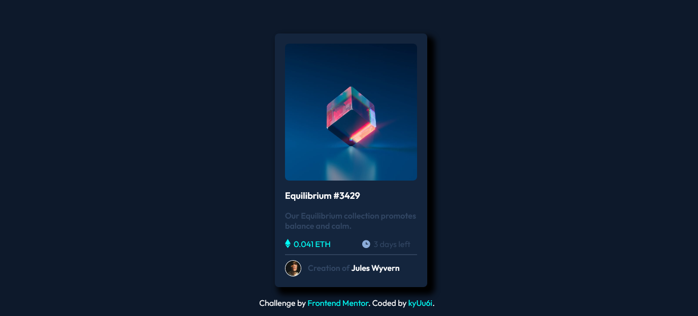

# Frontend Mentor - NFT preview card component solution

This is a solution to the [NFT preview card component challenge on Frontend Mentor](https://www.frontendmentor.io/challenges/nft-preview-card-component-SbdUL_w0U). Frontend Mentor challenges help you improve your coding skills by building realistic projects. 

-[Overview](#overview)
  - [The challenge](#the-challenge)
  - [Screenshot](#screenshot)
  - [Links](#links)
- [My process](#my-process)
  - [Built with](#built-with)
- [Author](#author)

## Overview
Well, this challenge is for beginner like me. Very simple and very easy and suitable for newbies.

### The challenge

Users should be able to:

- View the optimal layout depending on their device's screen size
- See hover states for interactive elements

### Screenshot

### Links

- Solution URL: [Here](https://hlaingmyohein.github.io/font-end-mentor/nft-preview-card/)
- Live Site URL: [Here](https://hlaingmyohein.github.io/font-end-mentor/nft-preview-card/)

## My process
I use html5, css and a few js code to solve this challenge.

### Built with

- Semantic HTML5 markup
- CSS
- JS

## Author

- Website - [HlaingMyoHein](https://hlaingmyohein.github.io/)
- Frontend Mentor - [@hmhlol](https://www.frontendmentor.io/profile/hmhlol)
- Twitter - [@HMHish3r3](https://twitter.com/HMHish3r3)

