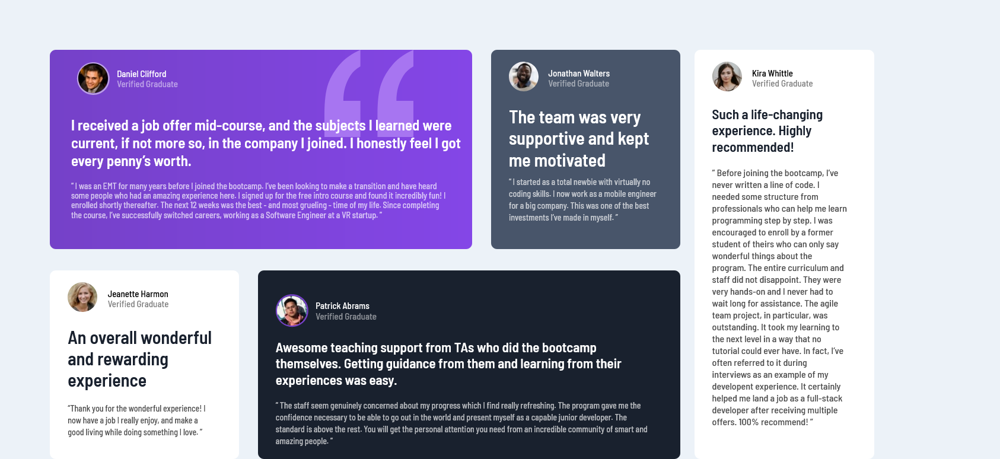

# Frontend Mentor - Testimonials grid section solution

This is a solution to the [Testimonials grid section challenge on Frontend Mentor](https://www.frontendmentor.io/challenges/testimonials-grid-section-Nnw6J7Un7). Frontend Mentor challenges help you improve your coding skills by building realistic projects. 

## Table of contents

- [Overview](#overview)
  - [The challenge](#the-challenge)
  - [Screenshot](#screenshot)
  - [Links](#links)
- [My process](#my-process)
  - [Built with](#built-with)
- [Author](#author)

## Overview

### The challenge

Users should be able to:

- View the optimal layout for the site depending on their device's screen size

### Screenshot

### Links

- Solution URL: [HERE](https://github.com/hlaingmyohein/hlaingmyohein.github.io/tree/main/font-end-mentor/testimonial-grid-section)
- Live Site URL: [HERE](https://hlaingmyohein.github.io/font-end-mentor/testimonial-grid-section/)

## My process

### Built with

- Semantic HTML5 markup
- CSS custom properties
- Flexbox
- CSS Grid

## Author

- Website - [HlaingMyoHein](https://hlaingmyohein.github.io/)
- Frontend Mentor - [@hmhlol](https://www.frontendmentor.io/profile/hmhlol)
- Twitter - [@HMHish3r3](https://twitter.com/HMHish3r3)
