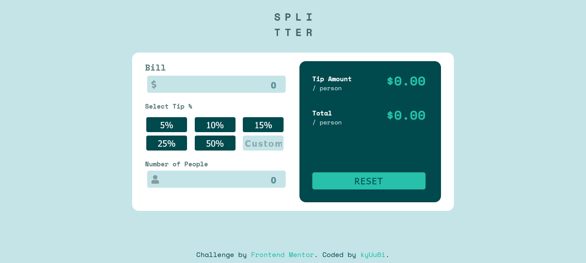

# Frontend Mentor - Tip calculator app solution

This is a solution to the [Tip calculator app challenge on Frontend Mentor](https://www.frontendmentor.io/challenges/tip-calculator-app-ugJNGbJUX). Frontend Mentor challenges help you improve your coding skills by building realistic projects.

## Table of contents

- [Overview](#overview)
  - [The challenge](#the-challenge)
  - [Screenshot](#screenshot)
  - [Links](#links)
- [My process](#my-process)
  - [Built with](#built-with)

## Overview
This is a tip calculator challenge. Your goal is to calculate the percentage of tip and the average value of bill for everyone in your group.

### The challenge

Users should be able to:

- View the optimal layout for the app depending on their device's screen size
- See hover states for all interactive elements on the page
- Calculate the correct tip and total cost of the bill per person

### Screenshot

### Links

- Solution URL: [HERE](https://github.com/hlaingmyohein/hlaingmyohein.github.io/tree/main/font-end-mentor/tip-calculator)
- Live Site URL: [HERE](https://hlaingmyohein.github.io/font-end-mentor/tip-calculator/)

## My process

### Built with

- Semantic HTML5 markup
- CSS
- JAVASCRIPT

## Author

- Website - [HlaingMyoHein](https://hlaingmyohein.github.io/)
- Frontend Mentor - [@hmhlol](https://www.frontendmentor.io/profile/hmhlol)
- Twitter - [@HMHish3r3](https://twitter.com/HMHish3r3)
